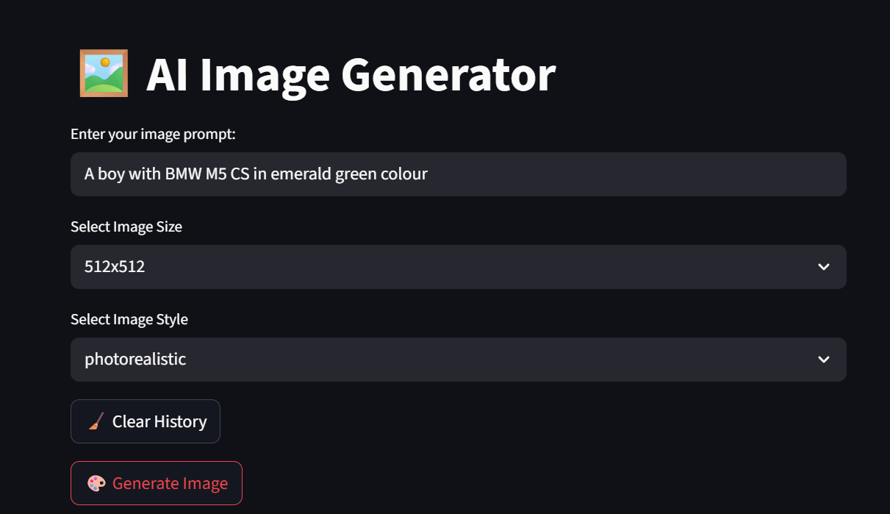

# 🖼️ AI Image Generator App (Streamlit + Stability AI)

This beginner-friendly AI Image Generator app allows users to create images from simple text prompts using the [Stability AI API](https://platform.stability.ai/) and [Streamlit](https://streamlit.io/).

---

## 🎯 Features

✅ Generate AI images from text prompts  
✅ Choose from different image sizes  
✅ Select image style (photorealistic, cartoon, fantasy, etc.)  
✅ View session history of generated images  
✅ Download generated images  
✅ Clear image history with one click

---

## 🧰 Tech Stack

- [Python 3.8+](https://www.python.org/)
- [Streamlit](https://streamlit.io/)
- [Stability AI API](https://platform.stability.ai/)
- `requests`, `dotenv`, `base64`

---

## 🖥️ App UI Screenshot




---

## 🛠️ How to Run the App Locally

### 🔁 Step-by-Step Setup

#### 1. Clone the repository

```bash
git clone https://github.com/yourusername/ai-image-generator-app.git
cd ai-image-generator-app
```

#### 2. (Optional) Create and activate a virtual environment

```bash
python -m venv venv
venv\Scripts\activate        # Windows
# OR
source venv/bin/activate     # Mac/Linux
```

#### 3. Install required packages

```bash
pip install -r requirements.txt
```

#### 4. Create a `.env` file and add your Stability API key

```env
# .env file
STABILITY_API_KEY=your_actual_api_key_here
```

> Get your API key from: https://platform.stability.ai/

#### 5. Run the Streamlit app

```bash
streamlit run app.py
```

---

## 🔐 .gitignore

```gitignore
.env
__pycache__/
*.pyc
```

---

## 🧪 requirements.txt

```txt
streamlit
requests
python-dotenv
```

---

## 📂 Folder Structure

```
ai-image-generator-app/
├── app.py              # Main Streamlit app
├── .env                # API key (not shared)
├── .gitignore
├── requirements.txt    # Required libraries
└── README.md           # This file
```

---

## 🌍 Optional: Deploy on Streamlit Cloud

1. Push your code to GitHub
2. Go to [https://streamlit.io/cloud](https://streamlit.io/cloud)
3. Click **"New App"**
4. Choose your GitHub repo and set `app.py` as the main file
5. In the **“Secrets”** section, add your API key like this:

```
STABILITY_API_KEY=your_actual_key_here
```

6. Click **Deploy**

---